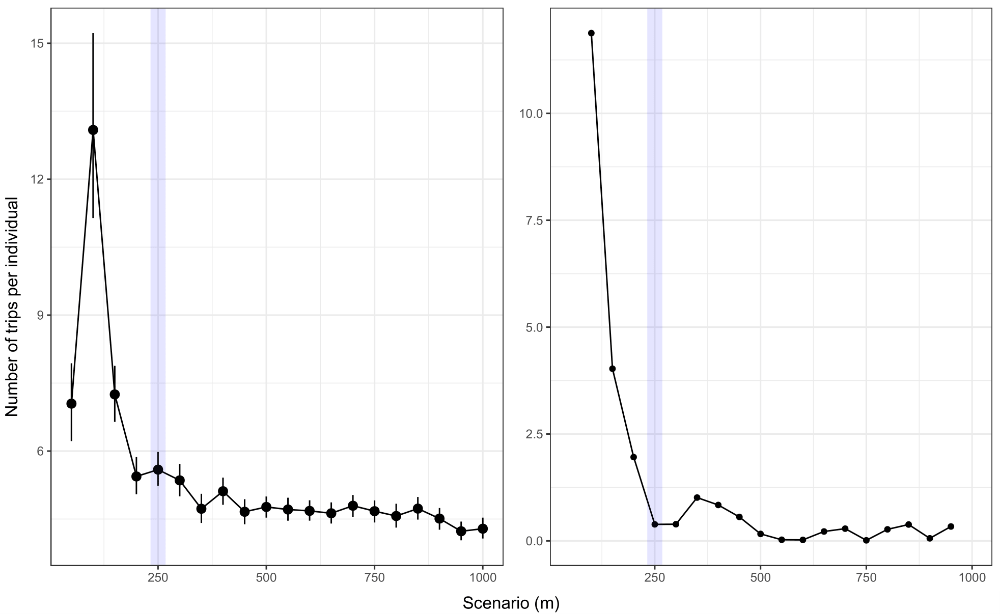

Tutorial Movement
================
Philip Bertrand
11/09/2020

<!-- badges: start -->
  [](https://travis-ci.com/PhilBertrand/CPFMove)
[](https://ci.appveyor.com/project/PhilBertrand/CPFMove)
[](https://codecov.io/gh/PhilBertrand/CPFMove?branch=master)
<!-- badges: end -->

This document is intended to provide basic information on how to use the
CPFMove functions. This package is designed to work with raw GPS data
and especially for species showing a central-place foraging behavior
(CPF i.e. tendancy to an animal to leave and return to a fixed based
between foraging trips, rather than being in constant roaming). The
package has three main objectives:

Falilitating the delineation of trip from raw GPS data for CPF species
Offering basic tools for filtering/enhancing the quality of the trips
Offering basic diagnostic tools for parameter selection Offering a basic
plotting function to visually assessed the reliability of delineated
tracks

## Data Format

The algortihm rely on a local metadata file that contains the
information necessary to accurately delineating trips. Nine arguments
are necessary for delineating trips (see below). Although this
information is mandatory, the algorithm is flexible in regards of
column’s names and can be specified accordingly in the main function

Clongitude: The colony longitude (WGS84) Clatitude: The colony latitude
(WGS84) MetalRing: The unique identifier of the captured bird GPSType:
The type of GPS used FIX: The programmed sampling interval of the GPS
Deployment: The standardized deployment date Recapture: The standardized
recapture date UTC\_Deployment: Standardized time of the deployment (UTC
recommended) UTC\_Retrieval: Standardized time of the recapture (UTC
recommended)

``` r
head(metafile)
```

    ##   Colony Clongitude Clatitude  Year MetalRing GPSType FIX Deployment  Recapture
    ## 1    OBS   12.28246  78.93942 GPS17   6234054  Catlog   2 2017-07-27 2017-07-29
    ## 2    OSS   12.44365  78.92961 GPS17   6234065   IGotU   2 2017-07-28 2017-07-30
    ## 3    OBS   12.28246  78.93942 GPS18   6228840   IGotU  10 2018-06-27 2018-06-30
    ## 4    OSS   12.44365  78.92961 GPS18   6228779   IGotU  10 2018-06-28 2018-07-01
    ## 5    OSS   12.44365  78.92961 GPS18   6228876   IGotU   2 2018-07-11 2018-07-17
    ## 6    OBS   12.28246  78.93942 GPS18   6228776   IGotU   2 2018-07-13 2018-07-15
    ##   UTC_Deployment UTC_Retrieval
    ## 1          11:29         13:20
    ## 2          12:36         13:40
    ## 3          15:10         11:31
    ## 4          11:23         12:50
    ## 5          11:05         09:43
    ## 6          10:51         11:53

## Trip Delineation

Trip delineation is performed via the filt() function. The function has
many arguments which among those, 5 has filtering effect (see ?filt()
for the corresponding details);

The main purpose of this package is to facilitate the delineation of
foraging trips from raw GPS data.Trip delineation is however a
relatively flexible procedure and rely essentially on how we define
“spatially” the colony.

The colony radius is the main parameter for delineation (see
BuffColony). In other words, this treshold (km) is used to build an area
around the colony’s centroid. From that area, all locations falling
inside will be categorized as “colony” locations and those falling
outside as “trip” ones. This binary category will thereafter be used for
segmenting each foraging trip, i.e. having the last point in the colony
before departure and the first point at the colony at arrival

Investigating effect of filtering options The BuffColony options have an
important effect on the resulting trip dataset. This package has two
functions for investigating such effect. These functions are essentially
bootstrap where variation within scenario are computed. These normally
described a decaying function of the number of final trips along
increment of the radius size of the colony and the minimal duration that
a trip should have. The second rate of change is also computed, among
means of the different bootstrapping scenario. User can thus decide of a
certain treshold to show where the variation among scenario “stabilize”.

Below an example of sensitivity of the response over a serie of radius
scenario.In that example, the optimal radius has been chosen as XXX km.
Using the second order rate of change (SORC), this scenario revealed to
have an absolute variation of less than 5% of the maximum average value
of the scenario tested (i.e. ca. 13.7, corresponding to a SORC of \<
13.7\*0.05)

 Which parameters selection is
highly dependable of the species under investigation and its relative
behavior. The function has in total 5 filtering options, which will
impact to a varying extent the final outputs:

Speed filtering is available (see speedTresh) and will remove locations
associated to a upper speed level. The function use the function
developped by Freitas et al. 2008 from the package “argosfilter”. This
function is itself based on the approach suggested by McConnell et
al. 2002, except in case where the relevant point is wihtin a distance
of 5 km from the previous fix. See references in the ?filt()
documentation Minimum trip length is a parameter to filterate very small
trips, corresponding to bathing trip, resting at some distance of the
colony or visiting neighbors. This parameter is in minutes (see
MinTripDur). One can filterate trip as function of the number of points
generated after interpolation. In other words, many tracks have many
missing points and a tracks composed from 90% interpolatde points might
not have the same representativity than another one that have only 10%.
This function let user to disciminate based on a certain treshold (see
filtNA)

Finally, on can also filterate as function of the completeness of the
tracks (see Complete). Depending of the question and data
representation, one could decide to only use complete trips for his/her
analyses Interpolation is executed by adehabitatLT::redisltraj().If you
want to add additional data to the final objects, these one needs to
could be easily attached from the metadata, using the metINFO =
c(“ring”, “year”, “colony”) object. The option splt let you split
the final object into an array instead of a data frame. In case the splt
is set to TRUE, the object can be unsplitted thereafter using
do.call(rbind, object)

## Plotting the delineated trips

The script has now produced one object containing the segmented trips.
One way to visualize those trips is to pass them into the plottingMAP()
function;

Using object from CPFmove class, the function plots each trip with the
colony (blue) distinctive of the trip’s locations (purple). The function
use the basemap() from the ggOceanMaps package in its pipeline. If
mulitple trips are given, the function will make

The script codes now for plotting only the first bird from the splitted
object (see splt object from the filt());
